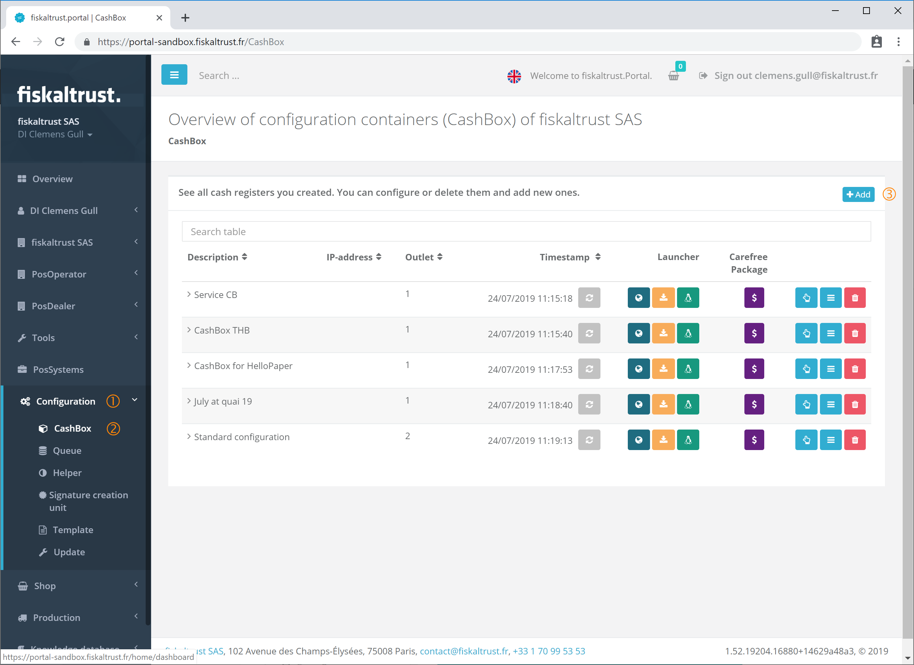
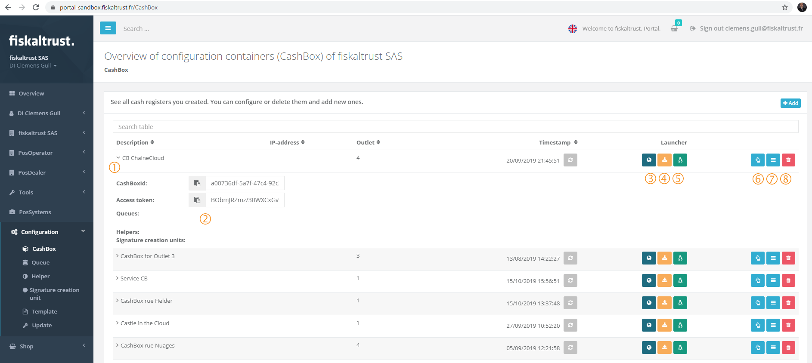
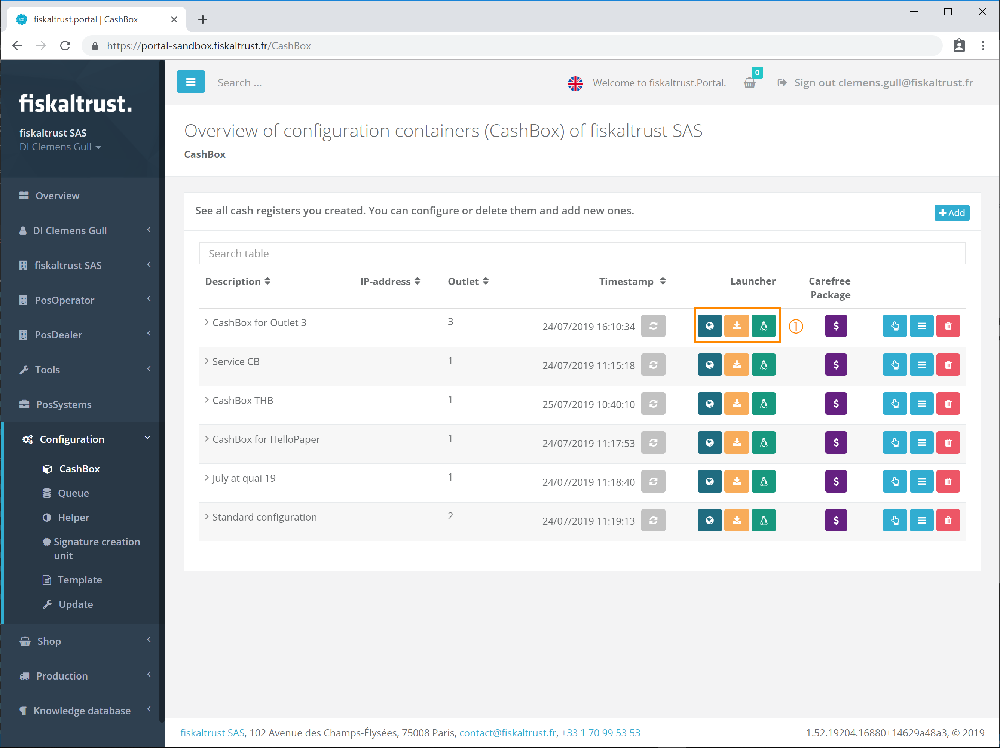
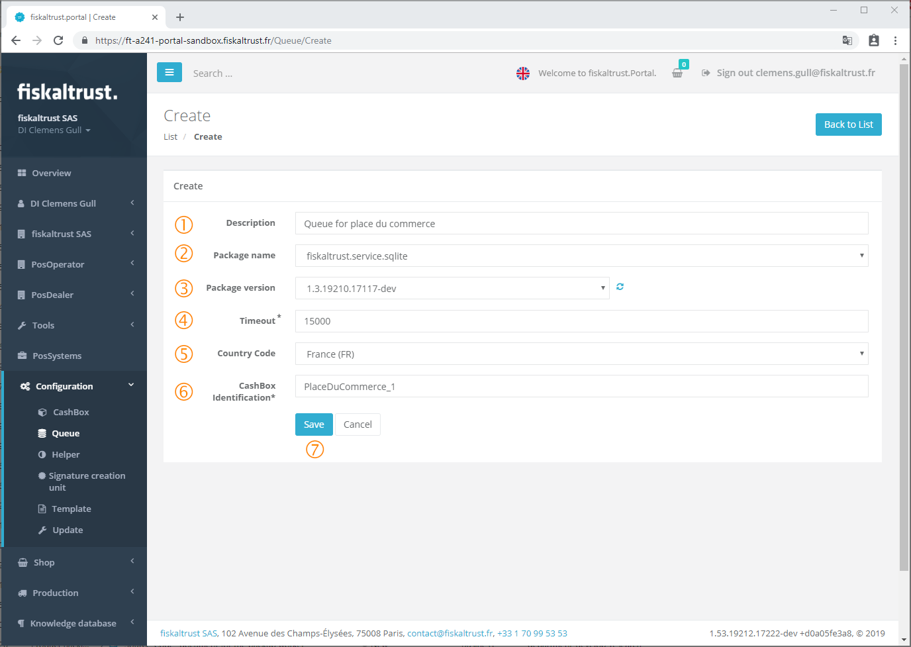
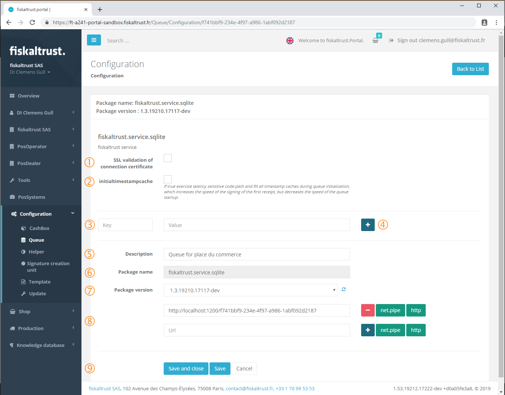
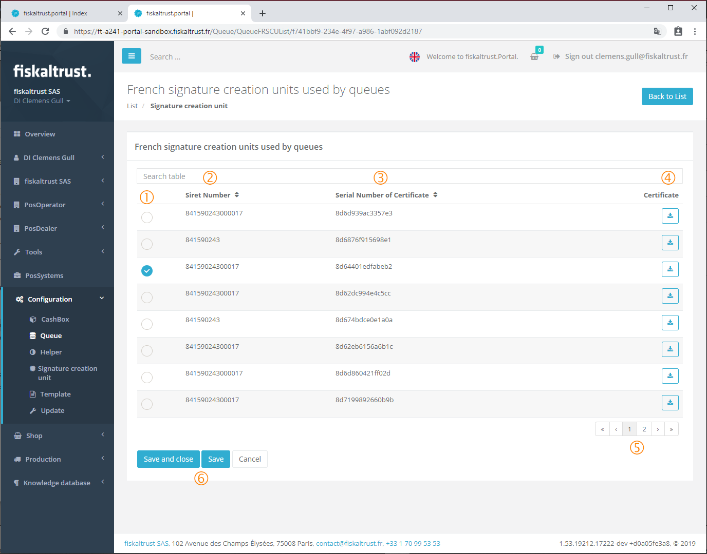

## Configuration

Before starting with the configuration the master data of the enterprise and the outlet has to be completed and checked. For this see chapter [_Master data_](company.md#ny-master-data) and [_Outlets_](company.md#company-outlets)

### CashBox

#### Creation of a CashBox

Creating the configuration containers

By opening the menu _Configuration_ and clicking on _CashBox_ the overview of all configured CashBoxes (configuration containers) is shown.
Click on [+&nbsp;Add] to create a new configuration container.

#### Add a CashBox

Configuration container - Add

 In this field, you can change the name of the configuration container. It should be unique so a CashBox can be identified in even a long list.

 If you are working in a network mode, enter the IP address of the endpoint here. 

 Click on [Save] to save the changes to the configuration container ad go back to the overview.

 Clicking [Cancel] cancels the operation without saving the changes and show the overview.

#### Overview first CashBox

Overview - First configuration container 

 After creating a CashBox, it is initially empty, it only has the _CashBoxID_ and the _AccessToken_ which are required to access the CashBox. It can be seen by opening the information section by clicking on the chevron on the beginning of the line.

 This area shows all the assigned queues, helpers and SCUs for the configuration container. Since the CashBox has just been created and nothing is stored yet, the fields are empty.

 By clicking on  you can download the _dotnet Launcher_. This must be used if there is an internet connection to the cash register.

 The _dotnet useOffline Launcher_ should be used if no internet connection can be established. This can be downloaded by clicking on .

 For using the fiskaltrust.Service with a MacOS or Linux system the _mono useOffline Launcher_ is needed. It can be downloaded by clicking on . This is set to _useOffline_ by default.

 If no _ArchiveAuditable_ has yet been purchased, the purchase can be made by clicking on . If a package has already been purchased, the validity date is displayed here.

 The CashBox can be edited with a click on  by Drag & Drop.

 The CashBox can also be edited in a list view by clicking on .

 By clicking on  an empty configuration container can be deleted.

#### Edit CashBox by Drag & Drop

Edit CashBox by Drag & Drop

 The first widget shows all the created queues in this account. This corresponds to a data acquisition protocol and therefore a POS-System.

 The second widget shows all created Helpers, which can be used in a CashBox, further information see chapter [_Helpers_](../handbook-general/configuration.md#helper).

 The last widget contains all the SCUs created in this account and can be used in a CashBox, further information can be found in chapter [_Signature creation unit_](#SCU). A SCU must not be direct associated to a CashBox. Because the configuration container has a connection to the outlet and the SCU is coupled to an outlet, a loose coupling in between exists. It is essential for legal compliance to use the same outlet number in the SCU-configuration and the CashBox-configuration. This loose coupling enabley the usage of a single SCU for more than one queue in the same outlet.

 The field _Outlet_ is mandatory and has to contain the number of a valid outlet. For further informations see chapter [_Outlets_](company.md#outlets).

 This field contains the active CashBox. Using Drag & Drop, untits from the three widgets on the right side can be integrated in this CashBox.

Clicking on [Save] stores the changes to the configuration container.

#### Edit CashBox by List

Furthermore, the CashBox can be edited via a list.

Edit CashBox by list

 The list view is divided into three sections showing the available objects (_Queues_, _Helper_, _Signature creation Unit_).

 The required objects can be added to the cash box by ticking the checkbox at the beginning if the row.

 Click  on the ending of a row to display the settings for each object.

 Each Queue owns a certificate for signing all the data send to. With the button   the certificate of a queue can be downloaded and verfified.

 For filtering all the tables/sections in this window at least 3 characters have to be entered. 

#### Ready configured CashBox

Ready configured CashBox

 By clicking on [+&nbsp;Add] you can create a new configuration container (CashBox).

 In the section _Queues_ the deposited POS-System identification number (_CashBoxID_) as well as the automatically generated AES key (Base64 encryption) (_AccessToken_) can be found. Clicking on  the confiiguration of the queue can be edited.

 In this section the connected helpers as well as the package name and version is shown. By clicking on  each helper can be configured in a own window.

 The connected signature creation units can be displayed here. But it is not necessary to connect a CashBox one-to-one to a SCU. Because a SCU can be used more than once for an outlet there is a loose connection between SCU and CashBox.

#### Delete a CashBox
For legal reasons it is currently not possible to delete a CashBox. However, there is the exception, that if the CashBox was not yet in use, it can still be deleted.

Before deleting a CashBox it has to be ensured that all elements from the configuration container are removed. Removing the element from the CashBox do not delete them, they are only put back in the general section for further use. If a CashBox is not empty it can not be deleted. By deleting a CashBox only the wrapping configuration container gets removed from the system. No data, certificate, queue, archives or anything else is touched or deleted.

Delete CashBox

#### Download Launcher

Download Launcher

 By clicking on one of this buttons, the launcher needed for commissioning is downloaded. This is a ZIP file that you download into the download folder. The zip-file can be founded in the local download-folder and ectrected there for further use on a POS-System.

For further information see chapter [Overview first CashBox](#overview-firstcashbox)

### Queue

Overview of queues

To get to the creation and _Configuration_ of a queue, click on the menu item _Queue_.

To find a specific queue a text can be entered in the search field. Starting with the second entered character the table beneath gets filtered automatically.

A click on the button _+&nbsp;Create new_ adds a new queue to the accoung

#### Add a queue

Queue - Adding

 This field, holds the name of the queue. It can be anything which helps to identify each queue.

 The appropriate storage method depending on your operating system can be selected. This value can not be changed after creation of the queue.

 The package version can also be selected using a dropdown menu. For updating the package version a click on  is mandatory. **To configure the POS-System with a law compliant fiksaltrust.Service the correct package has to be selected. The certified version for the used POS-System is written on the certificate, knows your PosDealer oder PosCreator.**

 Sets a timeout in milliseconds for the connection attempt with the signature creation unit.

 The country in which the queue is used can be selected in this dropdown list. This value can not be changed after creation of the queue. **For a law compliant configuration _France (FR)_ has to be chosen.**

 This identification value has to be unique in the account. This value can not be changed after creation of the queue.

 The [_Save_]-button creates the queue and stores it.

#### Queue configuration

The configuration has to be done directly after the creation of a queue. Nevertheless it can be changed afterwards with the  button in the queue overview.

Queue configuration

 This box can be ticked to activate the verification of the connection certificate.

 Activating this options speeds up the signing of the first certificate, but slows down the queue starting.

 This line gives the possibility to add a key-value-pair to the configuration of the queue.  The  button adds another line for a new pair and the  button removes the line from the configuration.

 The name of the queue can be changed in this field.

 The type of the storage can only be defined on queue creation and can not be changed later on.

 The package version can also be selected using a dropdown menu. For updating the package version a click on  is mandatory. **To configure the POS-System with a law compliant fiksaltrust.Service the correct package has to be selected. The certified version for the used POS-System is written on the certificate, knows your PosDealer oder PosCreator.**

 The URL to access the queue can be defined in this field. By clicking on  a URL is used, which is suitable for local use without internet connection, because no firewall settings are required. By clicking on , the system generates a URL with which the POS-System can access the queue. The URL can be renamed, to have it like this: [http://localhost.1200/Queuefiskaltrust](). The  button adds another line for a new URL and the  button removes the URL from the configuration.

 [Save] or [Save and close] saves the configuration of the queue (and closes the configuration module).

#### Queue overview

By opening the _Queue_-Module in the _Configuration_-menu an overview from all created queues are shown.

Queue overview

 Clicking on the _chevron right_ shows the base information for this queue and the used CashBox, if already configured.

 This column shows the localisation (for which country the queue is used) and the _CashBox identification_.

 The third column contains a checkmark  when the queue is activated. A so called _start receipt_ has been send and the queue is ready to sign and chain receipts or contains already some receipts. If this column is empty no start receipt was send or a _stop receipt_ was send and the queue does not accept any receipt for chaining and signing.

 A queue contains two type of journals. Both of them are chained and secured against changes and contains already transmitted receipts. By clicking on  all transmitted receipts are displayed in a list, see chapter [_ReceiptJournal of a queue_](#receiptjournal-of-a-queue). By clicking on  all important actions and status changes of the queue a shown in a list, see chapter [_ActionJournal of a queue_](#actionjournal-of-a-queue).

 To stop the transmission from the local POS-System to the queue the  button can be clicked. Starting from this moment the queue does not save any receipt in the cloud. With  the queue receives all the not transmitted receipts form the moment the button is clicked.

 The queue export can be started by pressing the button . For further information see chapter [_Export a queue_](#export-a-queue).

 The last column contains the commands to manage a queue.  By clicking on  the connected SCUs can be displayed and managed. For further information see chapter [_SCUs used by a queue_](#scus-used-by-a-queue). Here the configuration of the queue can be opened by clicking on , see [_Configure a queue_](#configure-a-queue). Clicking on  edits the description, package version and timeout of the queue, see [_Edit a queue_](#edit-a-queue). Clicking on  deletes the queue. However, the button for deleting the queue is currently inactive for legal reasons, so no queue can be deleted after creation. The possibility to delete a queue does not depend on the status or the content of a queue. Once created no deletion is possible. There will be an option to hide queues in the future.

#### SCUs used by a queue

Queue - Connected Signature Creation Devices (SCU)

 By setting a check mark the SCU to be connected to the queue is selected.

 The previously selected URL of the SCU is stored here.

 The drop-down menu allows you to choose between different timeout modes. Normal and Backup, and different times.

 Click on \[Save\]  to save the configuration of the queue.

#### Configure a Queue

#### Edit a Queue

#### ReceiptJournal of a Queue

Queue - Overview ReceiptJournal

 The receipts created so far are listed here.

 Click on  to display the respective receipt.

After selecting a receipt, it is displayed as follows.This view makes it possible to verify the accuracy of the receipt content.

Queue - Start receipt

#### ActionJournal of a Queue

#### Edit a queue

Queue - Edit

 In this field, you can change the name of the queue.

 The previously selected package name is displayed here.

 Here you can select from the various package versions using the drop-down menu. These can be updated by clicking on .

#### Export a queue

Queue - Export

 First you have to define the area which should be exported, this is done with the help of the receipt number and the slider.

 The export format must then be dragged to the left  using Drag\&Drop.

 The export target is also dragged to the left  using Drag\&Drop.

 Click on \[Start\] to start the export, then you will be redirected to a page showing the progress of the export. After completion of the export you will receive an info mail.

### Signature creation unit (SCU)

#### Creation of a SCU

Adding a signature creation device

 To create, configure and delete the signature creation devices, click on the "Signature creation device" menu item.

 Click on \[Create\] to open a page where a new signature creation device can be created.

#### Add Signature creation unit

Adding a signature creation device

 **Text:** "Here you can assign another signature creation device to your company. Enter the data and click on "Save".

 Here you can name your signature creation device.

 Here you can select the package to be used. This must be specified by the PosCreator.

 Click on \[Save\] to save the configuration of the SCU.

#### Overview of Signature creation units

Overview - Signature Creation Devices (SCU)

 To get to the configuration of the signature creation devices, click on the menu item "*Signature creation device*".

 Click on \[Create\] to go to the page for creating a new signature creation device.

 The name of the SCU is displayed here.

 By clicking on , the basic settings and package configuration for individual use of the signature creation device in the cash register can be called up again.

 By clicking on  things like the description, package name, version and mode of SCU may be edited.

 Click on  to delete the SCU. However, the button to delete the helper is currently inactive for legal reasons, so no helper can currently be deleted.

 A brief overview of the data for the selected signature creation device is displayed here.

 The search function can be used to search for a SCU by entering any parameter in the search field.

#### Configuration of a Signature creation unit

Signature Creation Device - Configuration

 The serial number of the certificate is stored here after creation.

 In this field, you can change the name of the signature creation device.

 Here you can create a URL for your signature creation device. By clicking on  you get a URL, which is suitable for local use without internet connection, because no firewall settings are required.

 By clicking on the , the system generates a URL for you with which the POS system can access the SCU. You can rename the URL yourself. This can look like this: [http://localhost.1200/SCUfiskaltrust]()

 Click on \[Save\] to save the configuration of the SCU.

#### Edit a Signature creation unit

Signature creation device - Edit

 In this field, you can change the name of the signature creation device.

 Here you can use the dropdown menu to select from the various package names.

 The package version can also be selected using a dropdown menu. These can be updated by clicking on .

 In the field Mode you can choose between the different modes "Normal", "Backup" and "Deactivated".

 Click on \[Save\] to save the configuration of the SCU.

#### Delete a Signature creation unit

For legal reasons, it is currently not possible to delete the signature creation device.

Signature creation device - Delete

 The button for deleting a SCU is currently inactive.
