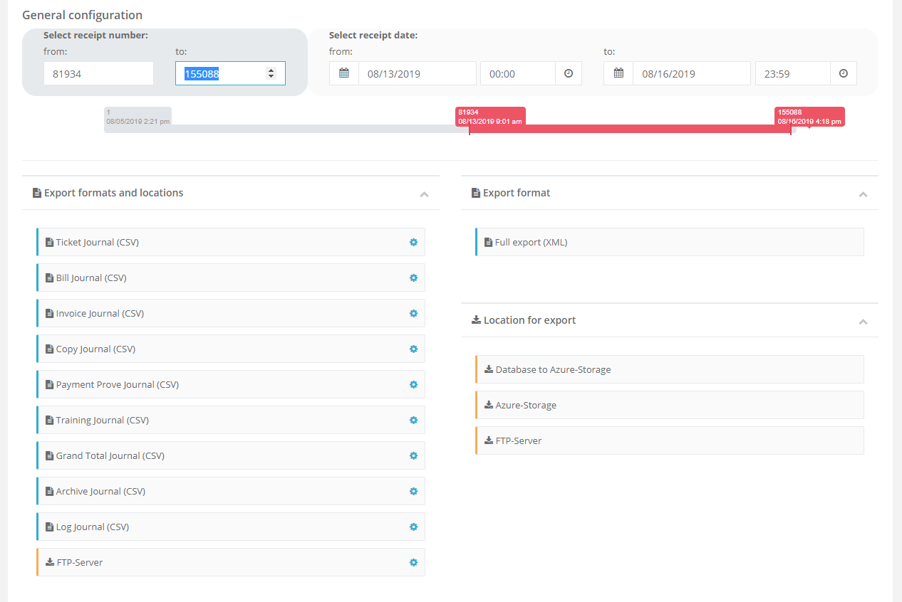
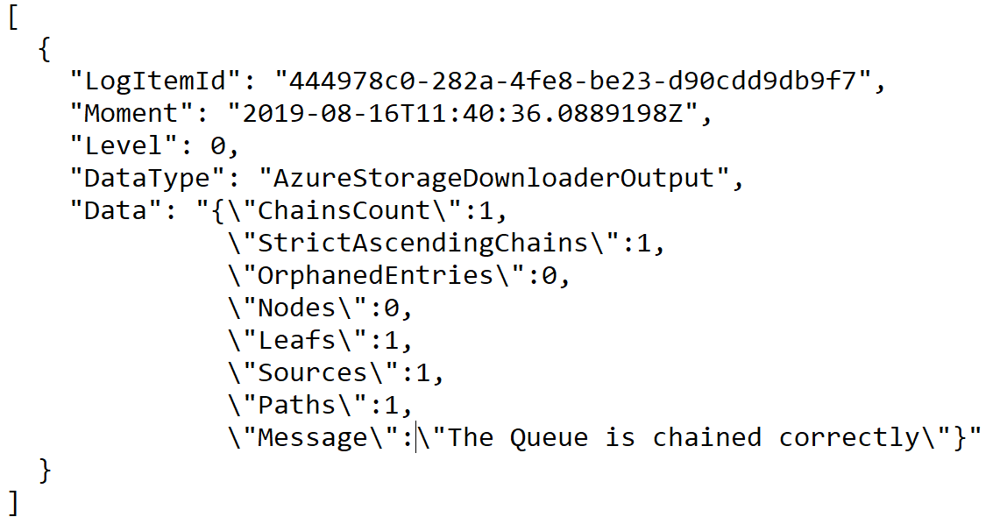
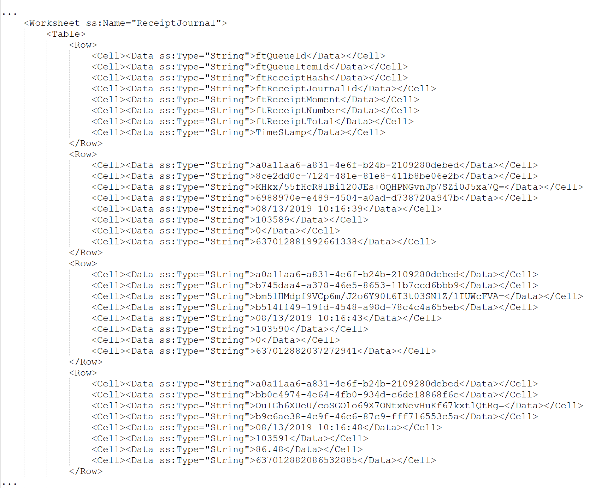

## Access for fiscal control

### 1. Login
In order to access the fiscal information, the controller willm need the PosOperator to login to the portal at https://portal.fiskaltrust.fr with his proper credentials.

Export fiscal archive - Login to the fiskaltrust.Portal

 Enter the email-address of the account to get fiscal archive.

 Enter the password according to the email-address used as user.

 Click on button [Login] to gain access to the fiskaltrust.Portal.

### 2. Identify queue for creating the fiscal archive

As the second step, the queue for the POS-System and/or outlet has to be identified for the fiscal control. An outlet usually has one queue which holds all the receipts issued. To enhance performance or avoid working issues there can be more than one queue per outlet. In this case, this and the following steps have to be repeated to get for each queue to access the fiscal information.

Export fiscal archive - Identify the queue to be exported in the fiskaltrust.Portal

 On the left side of the portal the menu can be found. Click on the word _Configuration_ to open this menu.

 Click on _Queue_ to show the whole list of queues created for the company.

 Each queue has its own description shown in this list. Normally it should be clear enough to identify the queue.

 Each queue is assigned to a _CashBox_ (a configuration container) and the ID of the CashBox can be found in the column _Localisation_. The _name/description_ can be found in the details of a queue. To access this information click on the chevron right just in front of the queue description.

 To start the configuration of the queue's export click on the export button .

### 3. Define the limits of the recepits to epxort

The first step to create a fiscal archive is the definition of receipts to be included in the export. For defining these limits, there are several possibilities offered by the fiskaltrust.Portal. Each of the methods result in the same archive. They are present to offer the best ways to limit the export. 

Export fiscal archive - Define the receipts to be included in the fiscal archive

#### Select by receipt number
Here the numbering of the queue itself is used, **don't use the local receipt number**. By changing value in the first line, the slider limits are ajusted automatically.

 Enter the number of the first receipt (which will be included) to export. If this number is larger than the maximum of the receipts stored in the queue nothing is exported.

 Enter the number of the last receipt (which will be included) to export. If this number is larger than the maximum of the receipts stored in the queue, the whole queue starting with the number entered by _from:_ is exported.

#### Select by date and time
Here the time of the fiskaltrust.Service is used. For this the date and/or time cannot be tampered with by the POS-System.

 Enter the date of the first day which should be included in the fiscal archive. By changing the date, the time of this day is set to _00:00_ so the first receipt of the day is included in all circumstances. By clicking on  the date can be selected from a graphical calendar.

 To adjust the time of first receipt in the fiscal archive, a time can be entered here. This can be used for example to export by the start of a shift. By clicking on  the time can be selected from a graphical clock.

 Enter the date of the last day which should be included in the fiscal archive. By changing the date the time of this day is set to _23:59_ so the last receipt of the day is included in all circumstances. By clicking on  the date can be selected from a graphical calendar.

 To adjust the time of last receipt in the fiscal archive a time can be entered here. This can be used for example to export to the end of a shift. By clicking on  the time can be selected from a graphical clock.

#### Select with the slider

 By dragging the left handle of the slider the starting point of the export can be fixed. When the dragging is finished and the mouse button is released, the date and time of the first exported receipt will be shown on the left handle.

 By dragging the right handle of the slider the end point of the export can be fixed. When the dragging is finished and the mouse button is released the date and time of the last exported receipt will be shown on the left handle.

### 4. Define journals to export

The journals included in an export have to be defined in this step. The fiskaltrust.Service divides the journal in several types.

Export fiscal archive - Drag journal elements to the export container

For including elements in the export container take an element from the right side by pointing with mouse on it, hold the left mouse button and drag it to the export container (gray area) on the left side. Once over this area, release the mouse button and drop the element.

For removing an element from the export container, just do the inverse and drag them to the right side.

Export fiscal archive - Journal elements to export

 **Ticket journal** TODO field description or link to it

 **Bill journal** TODO field description or link to it

 **Invoice journal** TODO field description or link to it

 **Copy journal** TODO field description or link to it

 **Payment Prove journal** TODO field description or link to it

 **Training journal** TODO field description or link to it

 **Grand total journal** TODO field description or link to it

 **Archive journal** TODO field description or link to it

 **Log journal** TODO field description or link to it

**Full export (XML)** 
This type is a combination of the eight journals mentioned above. These eight journals are converted to a xml-format containing the same data. This xml-file can be opened as clear text file with every editor. However, the xml is formated in a way that it can be opened in _Microsoft Excel_ too.

### 5. Define export locations

The export can be saved in additional locations shown on the right side. These elements can be dragged to the left side. For each location, one item has to be dragged to the left side. As default, the export is saved in the clients storage from fiskaltrust and no additional location has to be used.

Export fiscal archive - Storage locations of the export

For each location element in the export container, credentials have to be entered. The popup window is shown after a click on . Depending on the type of location the necessary credentials differ. No credentials are saved and are only used once to access the storage for saving the export.

### 6. Start the export

After adding the necessary journals and storage location the export has to be started.

Export fiscal archive - Storage locations of the export

At the bottom of the export module the button [Start export and close] has to be clicked to start the export in the background.

### 7. Running export

If the export has started and the status can be verified in the fiskaltrust.Portal.

Export fiscal archive - Verify a running export

The newest started export is shown on top of a list which can be called in the menu _Tools_ with the command _Export_.

In the first column the start date and time is shown. In the column _Targets_ the symbol  is shown until the end of the export.

### 8. Finished export

For a finished export, the information shown in the above window changes.

Export fiscal archive - Finished export

The symbol in the column _Targets_ changes to . For each location one icon is shown. By hovering with the mousepointer over it, a tooltip with the location is shown.

In the column _Formats_ a symbol for each journal and/or format is shown. For the journals the symbol  and for the xml-format the symbol  is displayed. As in the _Targets_ column, hovering over the icon shows a tooltip with more information.

The column _State_ shows information about the data. The first line shows how many paths with leafs are in the queue and the second line shows if the chain has errors or is correct.

In the last column _Info_ the first and last exported receipt number is shown and in the last row which queue was effected.

By clicking on the _chevron right_ the downloadable files are shown. Each export started in the fiskaltrust.Portal gets uploaded to the storage of the active account.

#### Information about the export

The file _output.json_ contains the information about the processed export and the checked data.

Export fiscal archive - Example of _output.json_

| field name | type        | meaning                              | example                                  |
|------------|-------------|--------------------------------------|------------------------------------------|
| LogItemId  | GUID        | ID of this export in the log journal | `7948984a-ef54-4c78-8404-66b397280442`   |
| Moment     | date / time | Moment of finished export            | `2019-08-19T23:18:44.245682Z`            |
| Level      | integer     |                                      | `0`                                      |
| DataType   | string      |                                      | `AzureStorageDownloaderOutput`           |
| Data       | json object |                                      |                                          |
Export fiscal archive - content of the _output.json_ (main part)

| field name            | type        | meaning                              | example                        |
|-----------------------|-------------|--------------------------------------|--------------------------------|
| ChainsCount           | integer     | number of chains exported            | `1`                            |
| StrictAscendingChains | integer     | number of chains with no errors      | `1`                            |
| OrphanedEntries       | integer     | entries with no parents and child    | `0`                            |
| Nodes                 | integer     | number of nodes in a chain           | `0`                            |
| Leafs                 | integer     | number of leafs in a chain           | `1`                            |
| Sources               | integer     | number of sources in a chain         | `1`                            |
| Paths                 | integer     | number of paths in a chain           | `1`                            |
| Message               | string      |                                      | The Queue is chained correctly |
Export fiscal archive - content of the _output.json_ (data object)

#### xml export

The full export in xml format contains all journals of a queue in a xml structure. This xml format is created as plain text file and readable with any editor, as shown in the following picture.

Export fiscal archive - Example of full xml export (code)

But the xml structure is done in the way for getting a Workbook in _Microsoft Excel_ if it is opened with this application, as shown in the following picture.

Export fiscal archive - Example of full xml export (_Microsoft Excel Workbook__)