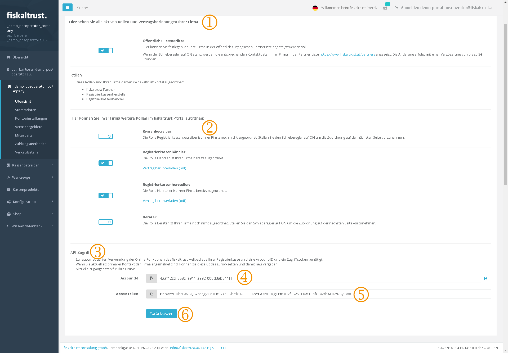
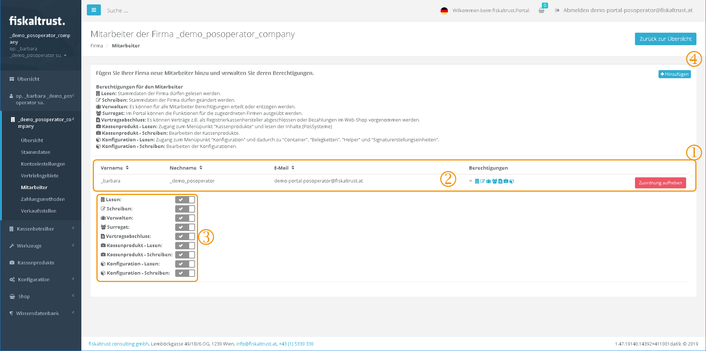
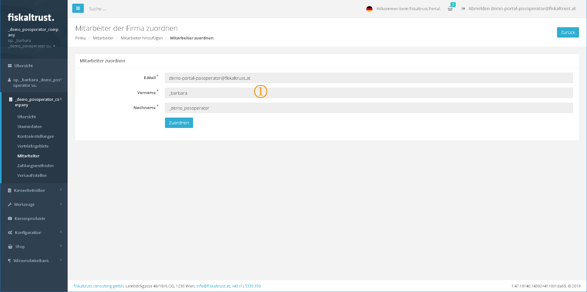
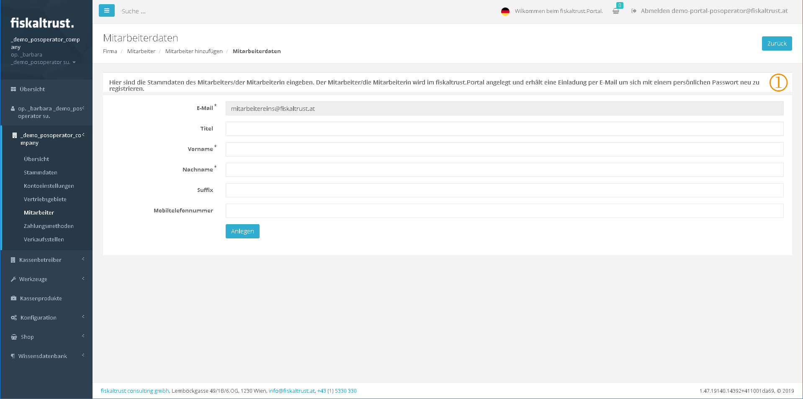

# fiskaltrust.Portal
## User and Company
### Company

#### Active roles and contractual relationships including API-access

Overview - All roles and contractual relationships with fiskaltrust

 **Text:** "Here you see all active roles and contractual relationships of your company."

 **Text:** "Here you can assign further roles in the fiskaltrust.Portal to your company:"

 **Text:** "API access

An account ID and an access token are required to automatically use the online functions of the ft.Helipad from your cash register.

If you are currently logged in as the company's primary contact, you can reset these codes and reassign them."

 Here an account ID is generated, which serves as identification of the company for the registration of the company to the ft.Helipad. This can be copied to the clipboard for manual transfer to the cash register.

 Here an AccessToken - as access key for the logon of the company to the fiskaltrust.Helipad is generated. This can be copied to the clipboard for manual transfer to the cash register.

 The button \[Reset\] can be used to regenerate the account ID and the AccessToken.

#### Company employees

Add new employees to your company and manage their permissions.

Company - Employees

 By default, the primary contact of the company is the user who registered the company as an employee.

 By clicking on the arrow next to the pictograms to display the authorizations, the sliders for changing the authorizations are displayed.

The different authorizations are described in chapter "[Employees of the company authorization administrations](#Employees-of-the-company-authorization-administration)".

 In this case, the primary contact of the company is displayed. This user always has full rights. These authorizations cannot be reset either. Therefore the sliders are grey and cannot be changed.

If no employee has the administrative rights, you loose the possibility to access thee fiskaltrust portal. In this situation the ft.team has to be contacted.

 With this button new employees can be added to the company.

#### Add employees

Add employees

 **Text:** "Here you can assign a new employee to your company. To do this, enter his/her email address."

 After entering the email address, the email address is searched for in the ft.portal.

#### Assign employees

Assign found fiskaltrust.contact as employee to the company

 If the contact with the email address that you are looking for has already been created in the ft.portal and is therefore found during the search, it is displayed.

This allows this user to be assigned as an employee. The master data of the sales activity cannot be changed here.

Email information that you have been assigned to a company as a fiskaltrust contact.

A contact can only be assigned to one company as an employee.

If no contact is found, it can be invited on the next page.

#### Add employees new contact details

On this page the master data of the new contact can be entered to create it in the ft.portal as a new user and at the same time as an employee of the company.

Add employees / Employee data

 **Text:** "Enter the employee's master data here. The employee is created in the fiskaltrust.portal and receives an invitation by email to re-register with a personal password".

After creating a new user - who is not yet registered as a contact in the ft.portal - an email invitation will be sent to him.

Email invitation of a new employee who is to register in the portal and is already assigned to a company as a contact.

### Employees of the company authorization administration

Authorization management for an employee

 **Text:** "** Authorizations for the employee:**

**Read:** Master data of the company may be read.

**Write:** Master data of the company may be changed.

**Manage:** Authorizations can be granted or withdrawn for all employees.

**Substitution:** In the portal the functions for the assigned companies can be exercised.

**Conclusion-of-contract:** Contracts can be concluded e.g. as a PosCreator or payments can be made in the web shop.

**Checkout-product-Read:** Access to the menu item "Checkout products" and reading the contents (PosSystems).

**Cash-product-Write:** Edit cash products

**Configuration-Read:** Access to the menu item "Configuration" and thus to "Container", "Receipt Chains", "Helper" and "Signature Creation Devices".

**Configuration-Write:** Edit configurations."

 The pictograms show the status of each authorization. If the authorization is not set, the pictogram is displayed in gray. If the authorization is set, the pictogram is displayed in blue. By clicking on the arrow next to the pictograms for displaying the authorizations, the sliders for changing the authorizations are displayed.

 The permissions can be changed by clicking on the sliders. The authorizations of other employees can only be changed by a user with the "*Administrate*" permission set to \[Enabled\].

 Clicking on \[Remove assignment\] cancels the assignment of the employee to the company immediately.

The employee could be reassigned later.

If the companies are assigned via the ft.portal, this administration of user rights can also be performed by an employee of a PosDealer for an assigned PosOperator.